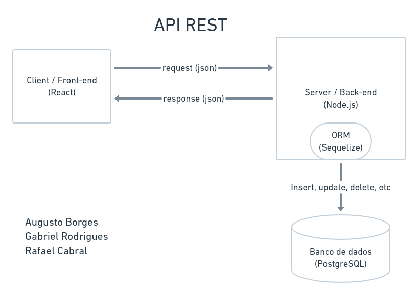

# Estilo arquitetural

## Nome do projeto:
  - MyShelf
  
## Arquitetura Definida
  - API Rest
  
### API Rest
| Front-end | Back-end | Database |
|-----------|----------|----------|
| React     | Node.js  |PostgreSQL|
-----------------------------------


  
### Front-End

#### React (components, routes, services, styles, etc)
 - React Router Dom para fazer a navegação entre as páginas da aplicação
 - Axios para conexão ao backend e para realizar requisições à api
 - Estilização de componentes com a biblioteca styled-components

Esboço inicial da estrutura de pastas e arquivos (entrypoint, components, router, etc)
```bash
front-end
├── dir1
│   └── file1
└── dir2
    └── file2
```

### Back-end

#### NodeJS
Citando aqui apenas as principais bibliotecas que já sabemos que iremos utilizar
 - Express.js para a abstração da camada http, requests e responses
 - Cors.js para habilitar a comunicação cross-origin (liberar acesso para o front-end)
 - Sequelize (ORM) para abstrair e facilitar a comunicação com o banco de dados
 
Esboço inicial da estrutura de pastas e arquivos (entrypoint, routes, services, etc)
```bash
/backend-end
├── /src
│   └── /app
|   |   └── /services
|   |   └── /middlewares
|   └── /config
|   └── /database
|   |   └── /migrations
|   |   └── /models
|   └── routes.js
|   └── app.js
|   └── server.js <= entry point
└── package.json

```
 
