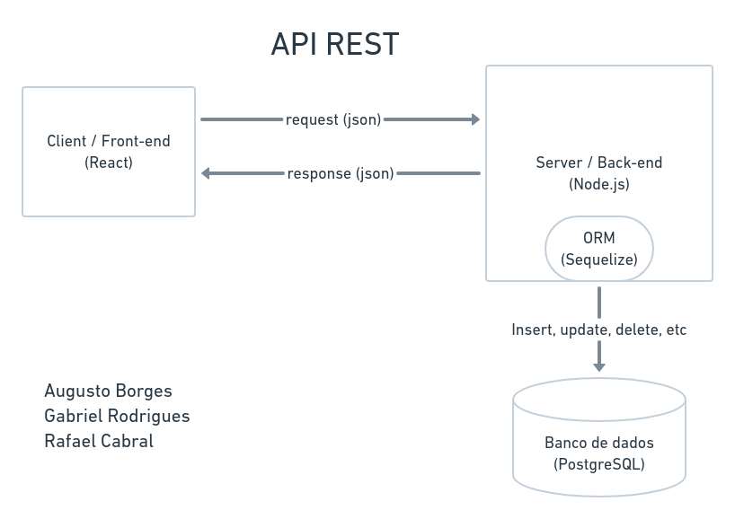
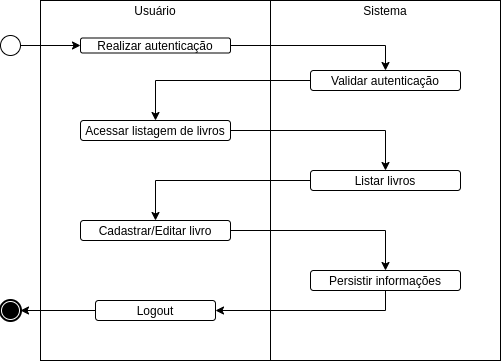
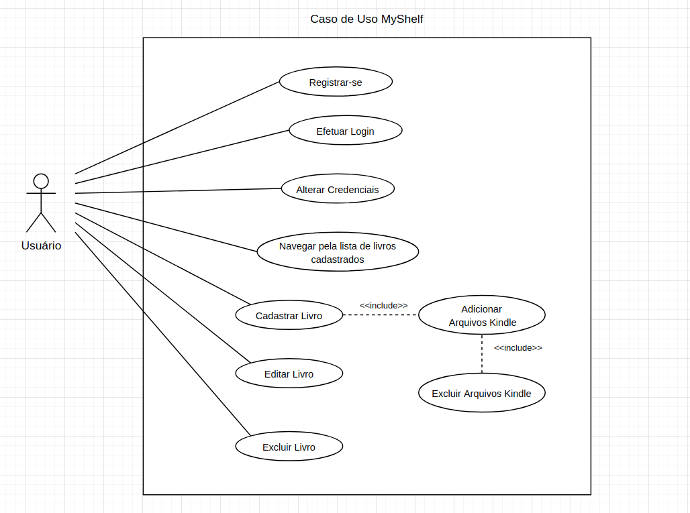

# Estilo arquitetural

## Visão Física

Seguindo o padrão arquitetural REST, teremos um front-end que consome uma api buscando dados no formato de JSON e traduz isso visualmente para o usuário no navegador.

A api por sua vez, responde requisições http que tem a origem no front-end, e responde essas requisições com dados que estão armazenados no banco de dados. O acesso ao banco de dados é feito pelo lado do server, que conecta ao banco e realiza as suas operações através de um ORM (sequelize) que ajuda a abstrair as operações desses dados.

## Visão do Processo

Aqui é representado um fluxo geral do sistema. Como o sistema de trata de um registro de livros para um usuário, o fluxo inicia pela autenticação, logo após a validação o usuário é direcionado para a sua listagem pessoal de livros, onde ele pode acessar os já cadastrados, editando ou excluido, ou pode cadastrar um novo livro. Ao fim do acesso, ele pode se deslogar do sistema.

## Visão de Cenários

