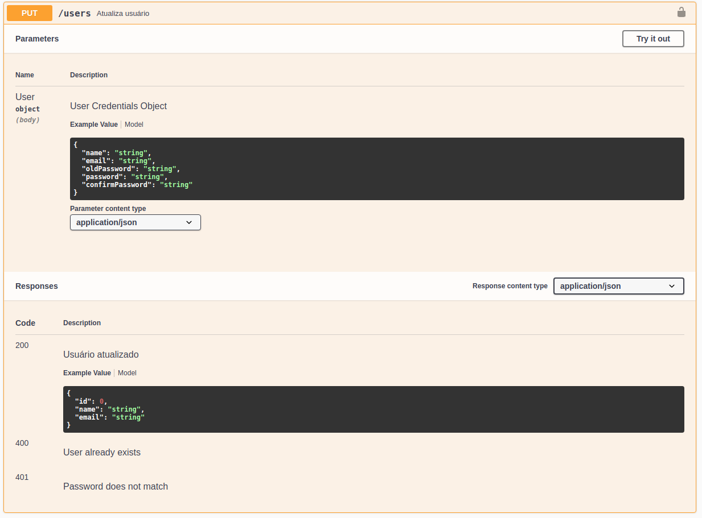

### MDA; XML E DTD

### Documentação Swagger

Foi criada a documentação da api utilizando o Swagger, para accessar  página do swagger basta rodar o projeto backend e acessar no browser a partir do endereço 

http://localhost:3333/swagger

##### Autenticação

##### Atualização de Usuário

##### Cadastro de livro por ID

##### Busca de livro por ID

##### Upload de Arquivos Kindle

