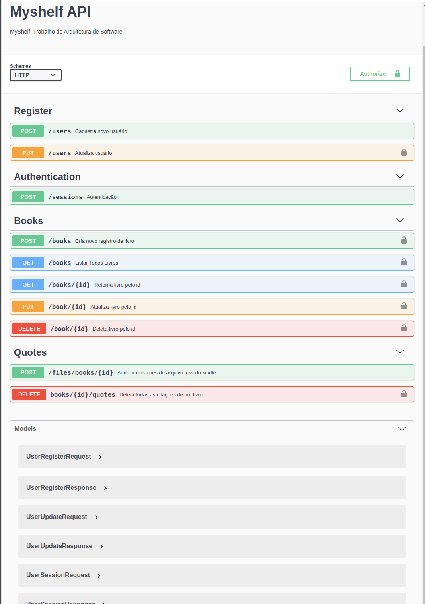

### API e Web Services - Documentação Swagger

Foi criada a documentação da api utilizando o Swagger, para accessar a página rodar o projeto backend e acessar no browser a partir do endereço: 

http://localhost:3333/swagger

Print abaixo do swagger

### Swagger - MyShelfAPI

